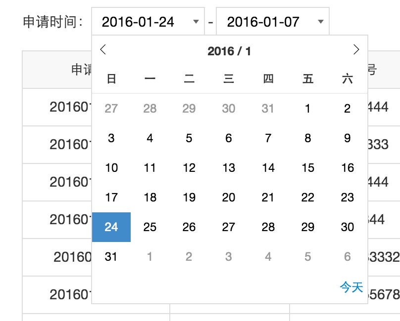

# Overview

v-datepicker is a vue datepicker directive.

# Usage

```JavaScript
Vue.directive('datepicker', require('v-datepicker'));
```

Basic use:

```HTML
<input type="text" readonly v-model="{modelName}"  v-datepicker="{modelName}" format="yyyy-MM-dd">
```
